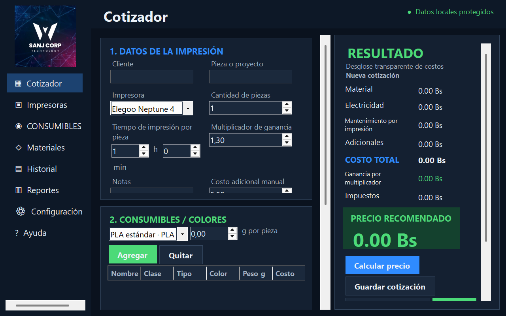

# Cotizador 3D · SANJ CORP TECHNOLOGY

Sistema privado de cotizaciones, inventario y ventas de impresión 3D. La edición web usa React, ASP.NET Core, Identity y PostgreSQL; el programa original de escritorio se conserva en `CotizadorSanjCorp3D/` como referencia y respaldo.



## Funciones principales

- Cotización por cliente, proyecto, impresora, tiempo, cantidad y consumibles multicolor.
- Catálogo e inventario de filamentos y resinas por tipo, color, peso y existencias.
- Alertas cuando el consumible elegido no tiene existencias.
- Códigos correlativos unidos y fáciles de copiar.
- Recuperación de cotizaciones por código, cliente o proyecto.
- Confirmación y reportes de ventas.
- Administración de impresoras, materiales, costos, impuestos y respaldos.
- Exportación CSV y respaldos JSON.
- Inicio de sesión, bloqueo por intentos fallidos, roles y autenticación de dos pasos.
- API protegida y almacenamiento PostgreSQL.

## Iniciar la edición web

En este equipo, abre PowerShell en la carpeta del proyecto y ejecuta:

```powershell
.\scripts\start-web.ps1
```

La página queda disponible en `http://127.0.0.1:5173/`. Para detener los componentes:

```powershell
.\scripts\stop-web.ps1
```

El script inicia la instancia aislada de PostgreSQL en `127.0.0.1:55432`, la API en `localhost:5079` y el frontend en `127.0.0.1:5173`. Los secretos de conexión y la cuenta inicial se guardan fuera del repositorio mediante .NET User Secrets.

## Módulos web

- Resumen operativo.
- Cotizador con múltiples filamentos/resinas y materiales adicionales.
- Catálogos de impresoras, consumibles e inventario y materiales.
- Historial, detalle imprimible y confirmación de ventas.
- Reportes por período y exportación CSV.
- Configuración de negocio, costos, impuesto y redondeo.
- Usuarios con roles Administrador, Ventas, Producción y Consulta.
- 2FA y respaldo/restauración de datos operativos sin credenciales.

## Verificación web

```powershell
dotnet build .\SanjCorp3D.Web.slnx
dotnet test .\Web\SanjCorp3D.Api.Tests\SanjCorp3D.Api.Tests.csproj
cd .\Web\sanjcorp3d-web
npm run lint
npm run build
```

## Requisitos para desarrollar

- Windows 10 u 11 de 64 bits.
- SDK de .NET 8.
- PowerShell 5.1 o superior.

## Inicio rápido

```powershell
git clone <URL-DEL-REPOSITORIO>
cd SANJ-CORP-3D
.\scripts\build.ps1
dotnet run --project .\CotizadorSanjCorp3D\CotizadorSanjCorp3D.csproj
```

Para generar la aplicación autónoma y el instalador:

```powershell
.\scripts\build-installer.ps1
```

Los resultados quedan en `artifacts/app` y `artifacts/installer`.

## Datos

Los datos web están en la instancia PostgreSQL aislada de SANJ CORP 3D. La base SQLite original permanece en `%LocalAppData%\SanjCorp3D\cotizador.db` y no se modifica durante la migración. Ninguna base, contraseña o clave de sesión debe agregarse al repositorio.

## Documentación

- [Arquitectura](docs/ARCHITECTURE.md)
- [Instalación y distribución](docs/INSTALLATION.md)
- [Lista de verificación de versiones](docs/RELEASE_CHECKLIST.md)
- [Contribución](CONTRIBUTING.md)
- [Seguridad](SECURITY.md)
- [Cambios de la versión](CHANGELOG.md)

## Estado

La edición web ya contiene los datos migrados y las funciones operativas del programa original. Está configurada para uso local seguro; la publicación en internet requiere un dominio HTTPS y un servidor PostgreSQL administrado.

Copyright © 2026 SANJ CORP TECHNOLOGY. Uso sujeto a [LICENSE.txt](LICENSE.txt).
